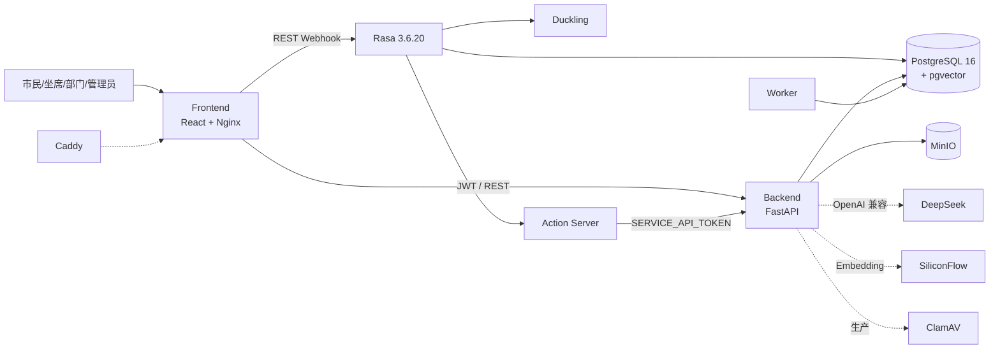

# 倾听助手工程实施基线

> 核对点：Commit `438047c776787da6c5b412c403c7799ba52364c8` · Alembic head **`0025`**。

## 系统架构图



开发 Compose（`docker-compose.yml`）**8** 服务：`frontend`、`backend`、`postgres`、`minio`、`rasa`、`action_server`、`duckling`、`worker`。

生产 override（`docker-compose.prod.yml`）追加：`caddy`、`clamav`；收紧宿主机端口。详见 [docs/DEPLOYMENT.md](docs/DEPLOYMENT.md)。

## 数据库核心表

| 表 | 用途 |
|---|---|
| `tickets` | 主单；`status` + `collaboration_status` + `version` |
| `work_orders` | 部门任务；submit/summary **不**直接 resolved |
| `kb_documents` / `kb_chunks` | 知识库与向量 |
| `ai_suggestions` | 建议原文；`review_decision` ∈ helpful/not_helpful/**adopted**/adopted_with_edits/rejected |
| `ai_usage_logs` | capability 审计；`estimated_cost_rmb` **估算** |
| `audit_logs` / `notifications` / `appeals` / `follow_up_tasks` | 审计、通知、申诉、回访 |

完整说明：[docs/database-design.md](docs/database-design.md)。Head = **0025**（含 0024 分诊/办件类型、0025 市政分类）。

## API 主链

```
POST /api/v1/auth/login
POST /api/v1/tickets
POST /api/v1/tickets/{id}/accept | /assign | /process | /note
POST /api/v1/tickets/{id}/work-orders/{wo_id}/submit
POST /api/v1/tickets/{id}/summary          → awaiting_review（主单仍 processing）
POST /api/v1/tickets/{id}/review-resolve   → resolved
POST /api/v1/tickets/{id}/feedback         → satisfied→closed / dissatisfied→保持 resolved
POST /api/v1/tickets/{id}/close            → closed（admin）
POST /api/v1/tickets/{id}/appeals          → submitted（主单不变）
POST /api/v1/appeals/{id}/review           → 批准→processing
POST /api/v1/ai/tickets/{id}/analyze       → triage_assistant | handling_assistant
```

无业务 SSE；`StreamingResponse` 仅附件/文件下载。

## request_id

`X-Request-ID` → ContextVar → 日志 / `audit_logs` / `ai_usage_logs` / 响应头。

## AI 调用链

```
Orchestrator：规则 → Guard →（可选）LLM → route
  policy_rag / service_guide / ticket_intake / ticket_progress / …

角色工作台：
  triage_assistant（坐席，pending|accepted）
  handling_assistant（部门，assigned|processing + 本部门）
```

| capability | 用途 |
|---|---|
| `triage_assistant` | 分诊与派发建议 |
| `handling_assistant` | 办件核查与文书建议 |
| `ticket_advice` | 工单详情侧栏兼容入口 |
| `policy_rag` / `service_guide` / `ticket_draft` / … | Orchestrator / RAG / 草稿 |
| `embedding_*` | 索引与查询 |

要点：

- Prompt：`llm_client.PROMPTS[...]`；Schema：`ai_schemas.py`；规则回退：`AiService._triage_bundle/_handling_bundle`。
- 采纳与质量反馈分审计动作；**均不修改** `ticket.status`。
- 坐席禁止生成 `document_draft`（须走 handling）。

## 降级

| 触发 | degrade_reason |
|---|---|
| 无 Key / LLM 失败 | `llm_unavailable` / `llm_call_failed` |
| Embedding 失败 | `embedding_fallback` |
| 预算 | `budget_exceeded` |
| 限流 | `rate_limited` |

实现：`orchestrator_guard.py`、`AiUsageRecorder`。

## 安全与权限

- `AuthorizationPolicy`：agent 可 `review_resolve`；department 可 `process`/`note`，**不可** resolve。
- KB `PUBLIC` / `DEPARTMENT` / `INTERNAL` 可见性过滤后再检索。
- 生产：弱密钥 / 宽 CORS / 未启 ClamAV 等 fail-fast；MinIO 容器内 HTTP，TLS 在 Caddy。
- `/metrics`：`MONITORING_TOKEN` 或 admin JWT（`require_metrics_access`）。
- Backend / Action 默认 `127.0.0.1` 绑定。

## 测试与 CI

默认门禁：单元/集成/构建 + Playwright **Smoke** +（main）docker-integration / production-compose。
**不是**全量三浏览器 E2E（`e2e-full` 仅手动）。

命令、「未验证」约定与 CI jobs 摘要：[docs/TESTING.md](docs/TESTING.md)；工作流定义见 `.github/workflows/ci.yml`。旧 CI 稿：[docs/archive/ci-design.md](docs/archive/ci-design.md)。

## 工程约束与取舍

- Schema 只走 Alembic；禁止推倒重建业务表。
- AI 始终 advisory_only。
- 不引入 K8s、独立向量库、Kafka 等重型组件作为本仓库交付前提。
- 文档只陈述已验证行为；未跑测试写「未验证」；成本写估算。
- 单机 Compose 优先可复现演示，而非微服务化拆分。

## 完成定义

阶段关闭须含：改动说明、验证命令与真实退出码、未验证项、剩余风险。不得将降级路径当作「真实 LLM 通过」证据。
