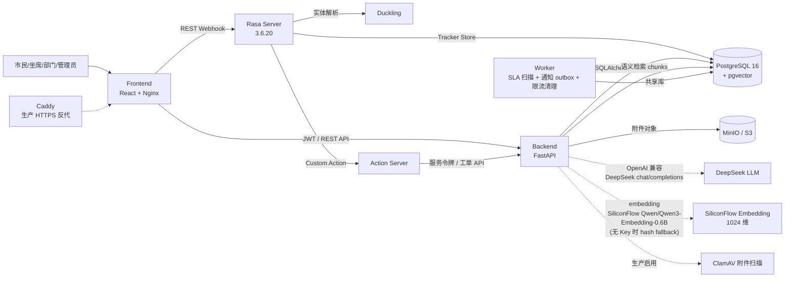

# 倾听助手工程实施基线

## 系统架构图



八个 Compose 服务职责（开发 `docker-compose.yml`）：

| 服务 | 责任 |
|---|---|
| `frontend` | React SPA、4 角色工作台、Nginx 代理和安全响应头 |
| `backend` | 登录、授权、状态机、工单、附件、KB、AI 建议、审计、集成接口 |
| `postgres` | 业务数据 + pgvector 语义检索 + Rasa Tracker Store |
| `minio` | 本地 S3 兼容对象存储，用于附件和 KB 上传 |
| `rasa` | NLU、对话策略、表单槽位、消息编排；会话持久化到 PostgreSQL |
| `action_server` | Rasa Custom Action，通过服务令牌调用 Backend |
| `duckling` | 时间、邮箱等结构化实体提取 |
| `worker` | SLA 临期扫描、通知 outbox 投递与重试、登录限流记录清理 |

生产 override（`docker-compose.prod.yml`）追加：`caddy`（HTTPS 反向代理，仅暴露 80/443）与 `clamav`（附件恶意文件扫描）。

## 数据库核心表说明

| 表 | 用途 | 关键字段 |
|---|---|---|
| `tickets` | 市民诉求主表 | `ticket_id`、`status`、`version`（乐观锁）、`idempotency_key`（幂等）、`assigned_department_id`、`category_id`、`priority`、`accept_due_at`/`resolve_due_at`（SLA） |
| `ticket_status_history` | 工单状态变更留痕 | `previous_status`/`current_status`、`operation_type`、`visibility`（public/internal）、`operator_user_id` |
| `work_orders` | 部门承办任务（主办/协办/复核） | `task_type`（primary/support/review）、`status`、`department_id`、`version`、`source_work_order_id`（转派链） |
| `work_order_history` | 部门任务状态变更 | `action`、`previous_status`/`current_status`、`content` |
| `kb_documents` | 知识库文档 | `status`（DRAFT/REVIEWING/PUBLISHED/REJECTED/WITHDRAWN/EXPIRED/PARSE_FAILED）、`visibility`（PUBLIC/DEPARTMENT/INTERNAL）、`version`、`replaces_doc_id`、`issuing_authority`、`expires_at` |
| `kb_chunks` | 文档分块 + 向量 | `embedding`（pgvector 1024 维）、`embedding_model`、`embedding_provider`、`embedding_fallback`（none/fallback_used/primary_failed）、`chunk_hash` |
| `ai_usage_logs` | AI 审计链路（10 capability） | `request_id`、`session_id`、`capability`、`provider`、`model_tier`、`total_tokens`、`latency_ms`、`degraded`、`degrade_reason`、`budget_exceeded`、`usage_unavailable`、`estimated_cost_rmb` |
| `audit_logs` | 业务审计 | `actor_user_id`、`actor_type`、`action`、`resource_type`、`resource_id`、`outcome`、`request_id` |
| `notifications` | 站内通知 | `recipient_user_id`、`event_type`、`event_key`（唯一，6 字段拼接的幂等键）、`status`、`delivery_status` |
| `notification_outbox` | 可靠投递 outbox | `idempotency_key`、`retry_count`、`max_retries`、`next_retry_at` |
| `follow_up_tasks` | 电话回访任务 | `ticket_id`、`handling_round`、`due_at`、`status` |
| `appeals` | 市民申诉 | `appeal_no`、`sequence`、`status`（submitted/approved/rejected/reprocess/completed）、`reviewed_by_user_id` |
| `ai_suggestions` | AI 建议原文 + 复核 | `suggestion_type`、`provider`、`model_name`、`input_fingerprint`、`risk_level`、`review_decision`（accept/reject/modify） |
| `ticket_feedbacks` | 市民评价 | `rating`、`result`（satisfied/reprocess/appeal）、`resolution_version` |
| `kb_feedback` / `kb_eval_cases` / `kb_eval_runs` / `kb_no_answer_questions` | RAG 反馈与评测 | 评测用例、运行记录、无答案问题追踪 |

> SLA 时限写在 `tickets.accept_due_at` / `tickets.resolve_due_at`（按 category×priority 在受理时计算）；`sla_policies` 表已在迁移 `0020` 删除，不再作为配置源。

## API 主链

完整工单生命周期 API 主链（FastAPI 路由）：

```
1. 认证      POST /api/v1/auth/login                          → {access_token, role, user}
2. 创建工单  POST /api/v1/tickets                              → TicketRead（citizen/agent/admin）
3. 受理      POST /api/v1/tickets/{id}/accept                  → accepted   (agent)
4. 派发      POST /api/v1/tickets/{id}/assign                  → assigned   (agent)
5. 承办      POST /api/v1/tickets/{id}/work-orders             → WorkOrderRead（部门创建协办/复核任务）
              POST /api/v1/tickets/{id}/process                → processing (department)
              POST /api/v1/tickets/{id}/note                   → processing (department note)
6. 提交结果  POST /api/v1/tickets/{id}/work-orders/{wo_id}/submit  (department 提交 work order 结果)
              POST /api/v1/tickets/{id}/summary                → collaboration_status=awaiting_review (department 汇总)
              POST /api/v1/tickets/{id}/review-resolve         → resolved   (agent 复核)
7. 办结      POST /api/v1/tickets/{id}/feedback                → closed     (citizen satisfied)
              POST /api/v1/tickets/{id}/close                  → closed     (admin 代办结)
8. 评价      POST /api/v1/tickets/{id}/feedback                → satisfied→closed / dissatisfied→保持 resolved
9. 申诉      POST /api/v1/tickets/{id}/appeals                 → submitted (citizen)
              POST /api/v1/appeals/{id}/review                 → approved→reprocess / rejected (admin)
```

辅助路由：

- 政策咨询：`POST /api/v1/orchestrator/chat`（route=policy_rag）
- 办事指南：`POST /api/v1/orchestrator/chat`（route=service_guide）
- 知识库：`/api/v1/kb/documents`、`/api/v1/kb/documents/{id}/publish`、`/api/v1/kb/retrieve`
- AI 用量：`/api/v1/admin/ai-usage/logs`、`/api/v1/admin/ai-usage/stats`（admin）
- 审计：`/api/v1/admin/audit-logs`（admin）
- 通知：`/api/v1/notifications`、`/api/v1/notifications/{id}/read`
- 回访：`/api/v1/follow-ups`、`/api/v1/follow-ups/{id}/phone-record`
- 附件：`/api/v1/tickets/{id}/attachments`（含 SHA-256、scan_status）

## request_id 全链路追踪

每个 HTTP 入口由 `X-Request-ID` 头注入 `request_id_context`（contextvar），无头时自动生成 `uuid4().hex`。所有后续动作贯穿同一 `request_id`：

1. **结构化日志**：每条日志带 `request_id` 字段，可在 stdout 中按 `request_id` 串联。
2. **`audit_logs.request_id`**：业务动作（accept/assign/resolve/close 等）写入审计时携带 `request_id`。
3. **`ai_usage_logs.request_id`**：每次模型调用（含降级、失败、缓存命中）记录同一 `request_id`。
4. **`integration_events.request_id`**：外部集成事件（OIDC/SMS/工单平台）携带 `request_id`。
5. **响应头**：FastAPI 中间件把 `request_id` 写回 `X-Request-ID` 响应头，前端可关联日志。

管理员在审计页 / AI 用量页可通过 `request_id` 一次查询出"市民请求 → 状态变更 → AI 调用 → 通知投递"的完整链路。

## AI 调用链

```
市民/坐席消息
  → OrchestratorService.process(message, user_context, session_id)
  → Step 1: _rule_detect（规则识别，confidence≥0.9 直接执行）
  → Step 2: Guard.check（输入长度/限流/去重/并发/预算/语义缓存）
  → Step 3: 必要时调 LLM（OOD 分类 / 草稿提取 / 答案生成）
  → _execute_route
      ├─ policy_rag     → KnowledgeBaseService.rag_answer → embedding 检索 + LLM 生成 + citations
      ├─ service_guide   → KnowledgeBaseService.rag_answer → embedding 检索 + LLM 生成
      ├─ ticket_intake   → LLM 提取动态字段 → 生成草稿（不建单）
      ├─ ticket_progress → 数据库查询工单状态
      ├─ human_handoff   → 返回 handoff 提示
      └─ out_of_scope    → 固定兜底回复
  → AiUsageRecorder.record_llm_call / record_embedding_call
  → 写入 ai_usage_logs（含 capability / provider / total_tokens / latency / cost / degrade_reason）
```

10 种 capability（`backend/app/services/ai_usage_recorder.py`）：

| capability | model_tier | 用途 |
|---|---|---|
| `orchestrator_classify` | llm_lite | 消息意图分类 |
| `ticket_draft` | llm_lite | 草稿动态字段提取 |
| `policy_rag` | llm_full | 政策咨询答案生成 |
| `service_guide` | llm_full | 办事指南答案生成 |
| `ticket_advice` | llm_full | 工单办理建议（摘要、风险、责任部门） |
| `ai_analyze` | llm_full | 综合分析 |
| `pre_review` | llm_lite | 提交前预审 |
| `embedding_index` | embedding | 知识库文档索引 |
| `embedding_query` | embedding | RAG 查询 embedding |
| `semantic_cache` | embedding | 语义缓存命中判定 |

## 降级机制说明

降级触发条件与统一标记：

| 触发 | degrade_reason | 标记字段 | 行为 |
|---|---|---|---|
| `AI_API_KEY` 为空 / LLM 超时 / 返回非法 JSON | `llm_unavailable` | `degraded=true, degrade_reason="llm_unavailable"` | Orchestrator 跳过 LLM；policy_rag/service_guide 退化为"仅检索原文 + 引用"；ticket_draft 退化为规则模板 |
| `EMBEDDING_API_KEY` 为空 / embedding 失败 | `embedding_fallback` | `embedding_fallback="fallback_used"` | RAG 检索回退到 PostgreSQL 关键词 + pg_trgm 模糊匹配；`kb_chunks.embedding_fallback` 记录 |
| 单用户/平台每日 LLM 调用超出预算 | `budget_exceeded` | `budget_exceeded=true, degraded=true` | Guard 拒绝 LLM 调用，返回降级提示 |
| 限流命中 | `rate_limited` | `rate_limited=true` | Guard 返回 429 提示，不调模型 |
| 模型返回 usage 缺失 | — | `usage_unavailable=true` | 不当作 0 tokens 处理，如实记录 |

实现位置：

- `OrchestratorGuard.check`（`backend/app/services/orchestrator_guard.py`）：输入/限流/去重/并发/预算/缓存判定。
- `OrchestratorService._execute_route`：路由执行 + 降级分支选择。
- `AiUsageRecorder.record_llm_call / record_embedding_call`：统一写入 `ai_usage_logs`，降级路径同样留痕。

## 安全与权限

### AuthorizationPolicy + Principal

`backend/app/authorization.py` 是权限单一真相源：

- `Principal`（frozen dataclass）：`kind`（user/service）+ `user_id` + `role` + `department_id`。
- `can_view(ticket)`：citizen 看本人、department_staff 看本部门（含 work_orders）、agent 看协调范围（非 closed/rejected）、admin 看全部。
- `require_transition(action, ticket)`：按角色 × action × 部门归属三元组校验，覆盖 accept/reject/assign/process/note/resolve/return_to_department/pause_sla/resume_sla/review_resolve 等。
- `apply_query_scope(statement)`：把数据范围下推到 SQL `WHERE`，保证列表查询与 `can_view` 一致。

### 知识库可见性过滤

`kb_documents.visibility` 三态过滤：

- `PUBLIC`：所有角色可见（含未登录访客限速）。
- `DEPARTMENT`：仅 `department_id` 匹配的部门人员 + admin 可见。
- `INTERNAL`：仅 admin + 上传者可见。

RAG 检索时 `KnowledgeBaseService` 先按 Principal 过滤可见文档集，再进行 embedding 检索，确保低权限用户不会拿到高权限文档的引用。

### 认证与限流

- JWT（`JWT_SECRET` + `JWT_ACCESS_TOKEN_MINUTES`，默认 30 分钟）。
- 密码哈希 Argon2（`security.hash_password`）。
- 服务令牌（`SERVICE_API_TOKEN`）：Action Server 调用 Backend 必带，不继承用户权限。
- 数据库共享登录限流（`login_attempts` 表，默认 5 次/60s）。
- 请求体大小限制（`MAX_REQUEST_BODY_BYTES`，默认 1 MiB）。
- 生产 config guard：弱密钥或未启用 ClamAV 时拒绝启动。

### 审计与脱敏

- `audit_logs` 记录主体、动作、资源、结果、`request_id`。
- `ai_usage_logs` 记录每次模型调用，含 `session_id`/`capability`/`total_tokens`/`degrade_reason`。
- 日志递归脱敏：密码、Authorization、Cookie、完整身份证号不写入。
- `integration_events` 只存元数据 + `payload_hash`，不存 payload 原文与凭据。

## 工程约束

- 不安装新的生产依赖、不改动生产密钥或外部系统，除非用户明确授权。
- 配置、模型提供方、端点和凭据必须由环境变量驱动；不硬编码或伪造真实外部能力。
- `backend/migrations` 是唯一 schema 演进路径；禁止推倒重建既有业务表。
- AI 始终是 `advisory_only`，不调用状态变更接口。
- 不引入 Kubernetes、Qdrant、Elasticsearch、Kafka 等重型组件。
- README、演示和测试报告只能陈述已真实验证的行为；规则建议、未配置集成、跳过项和环境失败必须明确标为未验证或不可用。

## 完成定义

每个阶段只在范围内所有代码、测试、运行与文档证据完成后关闭。输出必须包含改动文件、验证命令及退出码、未验证项、剩余风险和明确的阶段状态；不得将降级路径当作通过证据。
