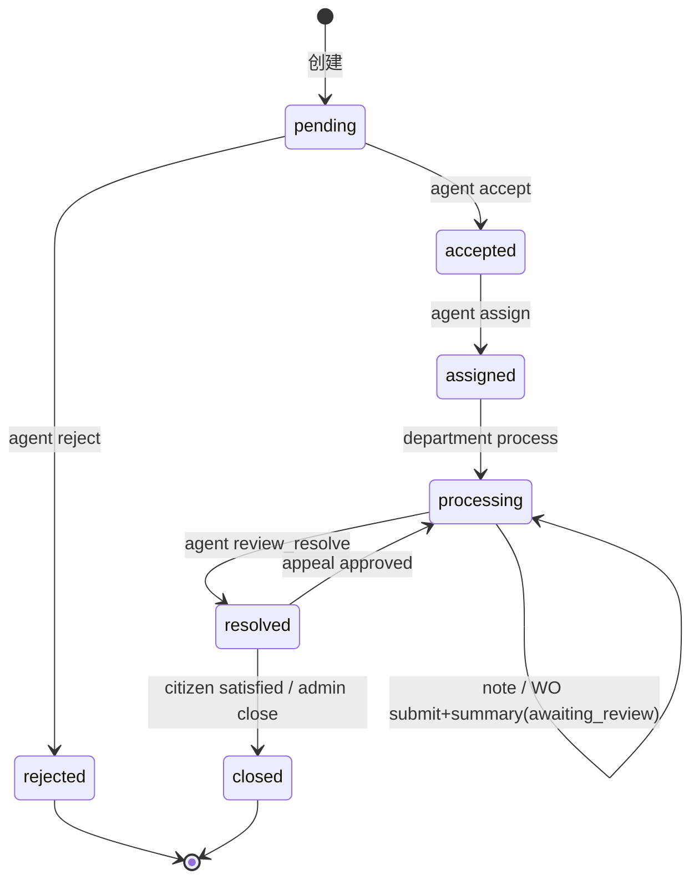

# 倾听助手产品基线

> 核对点：Commit `438047c776787da6c5b412c403c7799ba52364c8` · Alembic head `0025`。若与代码冲突，以可运行代码为准。

## 产品定位

倾听助手是面向市民诉求受理与跨部门协同办理的政务服务**演示平台**。系统将对话式诉求登记、政策咨询（RAG）、可信工单流转、跨角色办理、附件与审计、通知与回访、申诉重办、AI 办件辅助整合为可重复部署的单机工程交付。

当前是可运行 MVP：演示种子数据；外部短信/OIDC/地图/政务平台默认可配置且 disabled。**不宣称**真实政务生产高可用、等保或跨机房灾备。

必须保持的价值：业务状态与权限由后端可信控制；关键动作可审计；AI 仅提供可复核建议（三态人工确认）；可用固定演示数据复现主闭环。

## 用户角色与权限矩阵

| 能力 | citizen | agent | department_staff | admin |
|---|:---:|:---:|:---:|:---:|
| 创建诉求（表单/对话） | 是 | 是 | 否 | 是 |
| 政策咨询 / 办事指南 | 是 | 是 | 是 | 是 |
| 工单进度查询 | 本人 | 协调范围 | 本部门 | 全部 |
| 受理 / 拒绝 / 派发 | 否 | 是 | 否 | 是 |
| 部门处理 / 退回 / 转派 | 否 | 协调 | 本部门 | 是 |
| 提交 work order 结果 / 汇总待审 | 否 | 否 | 本部门任务 | 是 |
| 复核办结（`review-resolve` → `resolved`） | 否 | 是 | 否 | 是 |
| 市民满意关闭 / 管理员代办结 → `closed` | 本人 feedback | 否 | 否 | close |
| 申诉提交 / 审核 | 本人提交 | 否 | 否 | 审核 |
| 知识库上传 / 审核 / 发布 | 否 | 否 | 本部门 | 是 |
| 用户 / 部门 / 分类管理 | 否 | 否 | 否 | 是 |
| 审计 / AI 用量 | 否 | 否 | 否 | 是 |
| AI 分诊 `triage_assistant` | 否 | pending/accepted | 否 | 是 |
| AI 办件 `handling_assistant` | 否 | 否 | 本部门 assigned/processing | 是 |

权限实现：`backend/app/authorization.py` 的 `AuthorizationPolicy`（`can_view` / `require_transition` / `apply_query_scope`）。前端守卫不可替代后端。

演示账号：`citizen_local` / `agent_local` / `department_local`（综合受理）/ `admin_local`，密码 `SEED_PASSWORD`。

## 核心业务流程

### 1. 市民政策咨询（policy_rag）

```
市民提问 → Orchestrator 路由 policy_rag
  → KnowledgeBaseService.rag_answer（向量或关键词回退）
  → 返回答案 + citations；无证据 no_evidence，不编造
  → 市民明确确认后才可进入 ticket_intake
```

### 2. 工单全生命周期（正式路径）

```
提交 pending
  → 坐席受理 accepted / 拒绝 rejected
  → 派发 assigned（演示请派「综合受理」）
  → 部门 process → processing
  → 部门提交 WO 结果 → collaboration_status=awaiting_summary
  → 主办汇总 summary → collaboration_status=awaiting_review
       （主单仍为 processing，不是 resolved）
  → 坐席 review-resolve → resolved
  → 市民评价满意 → closed（citizen_confirmed）
     或管理员 close → closed
  → 市民评价不满意 → 保持 resolved（不自动重开）
  → 市民提交申诉 → appeals.submitted（主单状态不变）
  → 管理员批准申诉 → processing 重办 / 驳回则保持原状
```

每步：乐观锁、`ticket_status_history`、`audit_logs`、通知（worker 异步，失败不回滚主事务）。

### 3. 角色化 AI 辅助（advisory only）

| 页面 | capability | 允许状态 | 产出 | 禁止 |
|---|---|---|---|---|
| 智能分诊与派发 | `triage_assistant` | pending / accepted | 摘要、分类、紧急度、完整性、部门候选、SLA、告知语 | 办结文书、虚构已处理、自动派发 |
| AI 办件与文书 | `handling_assistant` | assigned / processing 且本部门 | 核查清单、方案、风险、政策要点、回复模板/草稿 | 改分类/改派、无事实写「已处理完成」、自动办结 |

```
analyze → 写入 ai_suggestions（不动 ticket.status）
  → 业务采纳 adopted / adopted_with_edits / rejected（仅审计）
  → 质量反馈 helpful / not_helpful（不写业务字段）
  → 真实受理/派发/提交结果仍在工单详情人工完成
```

代码：`ai_service.py`、`ai_schemas.py`、`IntelligencePage.tsx`、`AiCaseAssistant.tsx`。

## 工单状态机图



主单转移表见 `ticket_service.py:TRANSITIONS`；部门汇总与复核见 `work_order_service.py`（`summarize` / `review_and_resolve`）。

## AI 能力边界

- 所有建议 `advisory_only=true`。
- 不调用 accept/assign/review-resolve/close 等状态接口。
- 无真实办理事实时，handling 仅返回带【占位符】的模板。
- `estimated_cost_rmb` 为估算，非供应商账单。
- 无业务 SSE。

## 降级策略

| 场景 | degrade_reason | 行为 |
|---|---|---|
| 无 AI Key / LLM 失败 | `llm_unavailable` 等 | 规则/仅检索 |
| 无 Embedding Key / 失败 | `embedding_fallback` | 关键词 + pg_trgm |
| 超预算 | `budget_exceeded` | 拒绝 LLM |
| Orchestrator 不可用回退 | 前端明示 | 不得伪造成功建单 |

## 已完成能力与非目标

**做**：状态机与权限、SLA、通知、申诉、RAG、角色 AI、KB 可见性与原子索引、Compose 可复现。

**不做**：K8s、多机 HA、等保宣称、复杂 BPMN、多租户 SaaS、原生 App、自动电话外呼、自动行政决策/自动派发/自动办结、模型训练微调。

## 交付与验收

- 一条命令启动演示环境；四角色走通主闭环（见 [docs/DEMO.md](docs/DEMO.md)）。
- 默认测试门禁见 [docs/TESTING.md](docs/TESTING.md)；未跑过的结果写「未验证」。
- 部署与安全边界见 [docs/DEPLOYMENT.md](docs/DEPLOYMENT.md)。

本文件与 `ENGINEERING.md`、`README.md` 共同构成产品基线。
