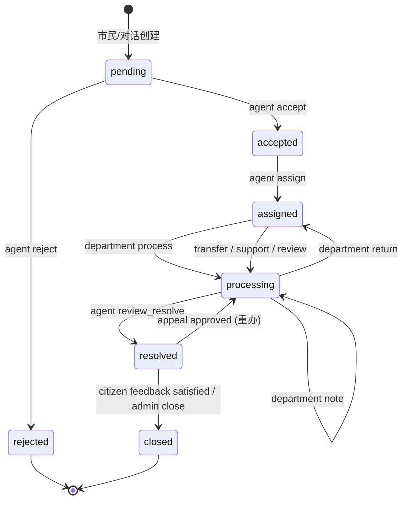

# 倾听助手产品基线

## 产品定位

倾听助手是面向市民诉求受理与跨部门协同办理的政务服务演示平台。系统将对话式诉求登记、政策咨询（RAG）、可信工单流转、跨角色办理、附件与审计证据、通知与回访、申诉重办、AI 办件辅助建议整合为可重复部署和验证的单机工程交付。

本项目当前是可运行、可演示的工程化 MVP，所有数据均为演示种子数据；不宣称达到真实政务生产系统的高可用、等保或跨机房灾备标准。外部短信/OIDC/地图/政务平台均为可配置适配器，默认 disabled。

产品必须保持的价值是：业务状态和权限由后端可信控制；所有关键动作可审计；AI 只提供可复核建议（advisory only，三态人工确认）；系统可用固定演示数据稳定复现主闭环。

## 用户角色与权限矩阵

| 能力 | citizen | agent | department_staff | admin |
|---|:---:|:---:|:---:|:---:|
| 创建诉求（表单/对话） | 是 | 是 | 否 | 是 |
| 政策咨询（policy_rag） | 是 | 是 | 是 | 是 |
| 办事指南（service_guide） | 是 | 是 | 是 | 是 |
| 工单进度查询 | 是（本人工单） | 是（协调范围） | 是（本部门） | 是（全部） |
| 受理 / 拒绝 / 派发 | 否 | 是 | 否 | 是 |
| 部门处理 / 退回 / 转派 | 否 | 协调 | 是（本部门） | 是 |
| 提交处理结果（部门 work order submit） | 否 | 否 | 是（本部门任务） | 是 |
| 复核办结（review-resolve → resolved） | 否 | 是 | 否 | 是（紧急旁路仍保留 deprecated `/resolve`） |
| 市民确认关闭（feedback satisfied → closed） | 是（本人工单） | 否 | 否 | 是（代办结 close） |
| 市民确认 / 评价 / 申诉 | 是（本人工单） | 否 | 否 | 管理审核 |
| 知识库上传 / 审核 / 发布 | 否 | 否 | 是（本部门文档） | 是 |
| 用户 / 部门 / 分类 / SLA 管理 | 否 | 否 | 否 | 是 |
| 审计日志查看 | 否 | 否 | 否 | 是 |
| AI 用量与安全查看 | 否 | 否 | 否 | 是 |
| 外部平台配置 | 否 | 否 | 否 | 是 |
| AI 建议（ticket_advice / pre_review） | 否 | 是（工单范围） | 是（本部门工单） | 是 |

权限实现集中在后端 `backend/app/authorization.py` 的 `AuthorizationPolicy`：
- `can_view` 控制数据可见性（citizen 看本人、department_staff 看本部门、agent 看协调范围、admin 看全部）。
- `require_transition` 控制动作权限（按角色 × action × 部门归属三元组校验）。
- `apply_query_scope` 把同一数据范围下推到 SQL 查询，保证列表与详情一致。
- 前端路由守卫只负责用户体验，不能替代后端权限校验。

## 核心业务流程

### 1. 市民政策咨询（policy_rag）

```
市民输入问题
  → Orchestrator 规则识别（POLICY_WORDS 命中）
  → 路由 policy_rag
  → KnowledgeBaseService.rag_answer
  → pgvector 语义检索 top-K chunks（embedding_fallback 时回退关键词检索）
  → LLM 生成答案（要求引用 chunks）
  → 返回 answer + citations[]（含 title/doc_number/issuing_authority/excerpt）
  → 若 no_evidence：提示"未检索到相关政策，是否创建咨询工单？"
  → 市民明确确认后才能进入 ticket_intake
```

### 2. 工单全生命周期

```
提交（pending）
  → 坐席受理（accepted） / 拒绝（rejected）
  → 派发责任部门（assigned）
  → 部门开始处理（processing）
  → 部门提交 work_order 结果 → 部门汇总（collaboration_status=awaiting_review）
  → 坐席复核（resolved）
  → 市民评价满意（closed） / 管理员代办结（closed）
  → 市民评价不满意（保持 resolved，不自动重开）
  → 市民提交申诉（appeal submitted）
  → 管理员审核通过（processing，重办）/ 驳回（保持 resolved）
```

每步：版本号乐观锁、`ticket_status_history` 留痕、`audit_logs` 审计、`notifications` 通知（worker 异步投递）。

**citizen 办结路径**：市民不直接调用 `close`，而是通过 `POST /api/v1/tickets/{id}/feedback` 提交评价；`rating=satisfied/mostly_satisfied` 时服务层把状态从 `resolved` 改为 `closed`，`closure_type=citizen_confirmed`。`rating=dissatisfied` 时状态保持 `resolved`，市民需另行提交申诉。

### 3. AI 办件助手（advisory only）

```
坐席/部门人员打开工单
  → 触发 AI 助手（ticket_advice / pre_review / ai_analyze）
  → LLM 生成摘要、风险提示、责任部门建议、文书草稿
  → 写入 ai_suggestions 表（advisory_only=true，不动 ticket.status）
  → 工作人员三态人工确认：accept / reject / modify
  → accept：将建议内容作为正式答复草稿，仍需人工提交 close 动作
  → reject：建议丢弃，仍由人工处理
  → modify：人工修改后作为草稿
```

AI 永远不直接调用 `accept`/`assign`/`resolve`/`close` 等状态变更接口。

## 工单状态机图



状态机由 `backend/app/services/ticket_service.py:TRANSITIONS` 字典集中定义，非法转换返回 `BusinessError`，旧版本号返回 `409 VERSION_CONFLICT`。

## AI 能力边界（advisory only，不自动决策）

- 所有 AI 输出必须标记 `advisory_only=true`，不得直接修改工单状态、权限或责任部门。
- AI 建议保存到 `ai_suggestions` 表，与工单状态和版本解耦；每条记录 `provider/model/prompt_version/latency/risk_level/confidence`。
- AI 不调用 `accept`/`reject`/`assign`/`resolve`/`close` 等命名业务动作接口；这些接口必须由人工触发。
- 文书草稿必须由工作人员复核后，才能作为正式处理内容使用。
- 政策咨询（policy_rag）找不到证据时返回 `no_evidence`，不编造答案；市民明确确认后才创建咨询工单，避免误建单。
- 真实模型只允许通过环境变量配置的 OpenAI 兼容接口接入（DeepSeek + SiliconFlow Embedding）。
- 连接器默认关闭；未配置真实 URL 和令牌时，系统明确返回"未配置"，不伪造成功。

## 降级策略

| 场景 | degrade_reason | 行为 |
|---|---|---|
| `AI_API_KEY` 为空 / LLM 超时 / 返回非法 JSON | `llm_unavailable` | Orchestrator 跳过 LLM，policy_rag/service_guide 退化为"仅检索原文 + 引用"，ticket_draft 退化为规则模板 |
| `EMBEDDING_API_KEY` 为空 / embedding 调用失败 | `embedding_fallback` | RAG 检索回退到 PostgreSQL 关键词 + pg_trgm 模糊匹配，仍返回引用但召回率下降 |
| 单用户/平台每日 LLM 调用超出预算 | `budget_exceeded` | Guard 拒绝 LLM 调用，返回降级提示，记录 `budget_exceeded=true` |

所有降级路径统一写入 `ai_usage_logs`，`degraded=true` + `degrade_reason` 标注原因，管理员可在 AI 用量页清晰区分真实调用与降级调用。

## 本轮范围与非目标

已完成三轮开发：

- **Round 1 业务闭环**：状态机、权限、SLA、通知、申诉、回访。
- **Round 2 AI 可信度**：`ai_usage_logs` 审计链路、policy_rag 不建单、service_guide 接 RAG、多意图、session 隔离、三态确认、降级标记。
- **Round 3 验收取口**：真实 Token 证据、session_id 筛选、引用字段完整、演示环境、全量测试、文档。

不做 Kubernetes、多机高可用、跨机房灾备、复杂 BPMN、多租户 SaaS、原生 App/小程序、自动电话外呼，以及自动行政决策、自动拒绝、自动派发或自动办结。不训练或微调模型。

## 交付与验收目标

- 一条命令启动完整演示环境，四角色用固定演示账号完成主闭环。
- 默认测试、迁移检查和 E2E 有真实通过证据（详见 [docs/final-test-report.md](docs/final-test-report.md)）。
- 真实 LLM 调用产生 `ai_usage_logs` 记录，`total_tokens > 0`，`provider=deepseek`。
- 降级路径有明确 `degrade_reason`，演示不中断。

本文件与 `ENGINEERING.md`、`README.md`、`docs/final-test-report.md` 共同构成产品与工程基线；若描述与当前代码冲突，以可运行代码与已验证测试结果为准。
