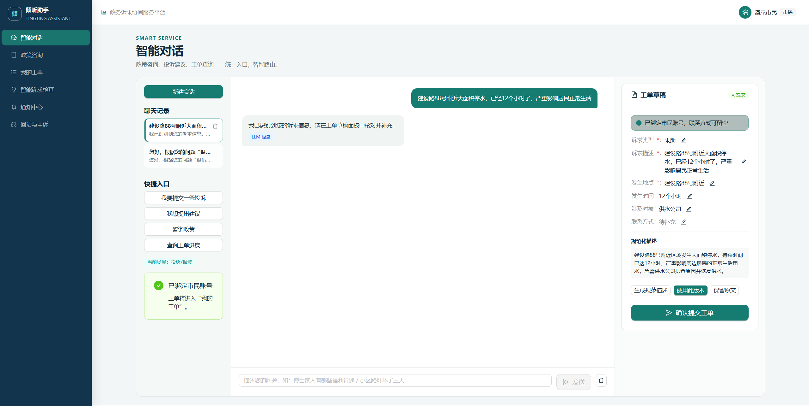
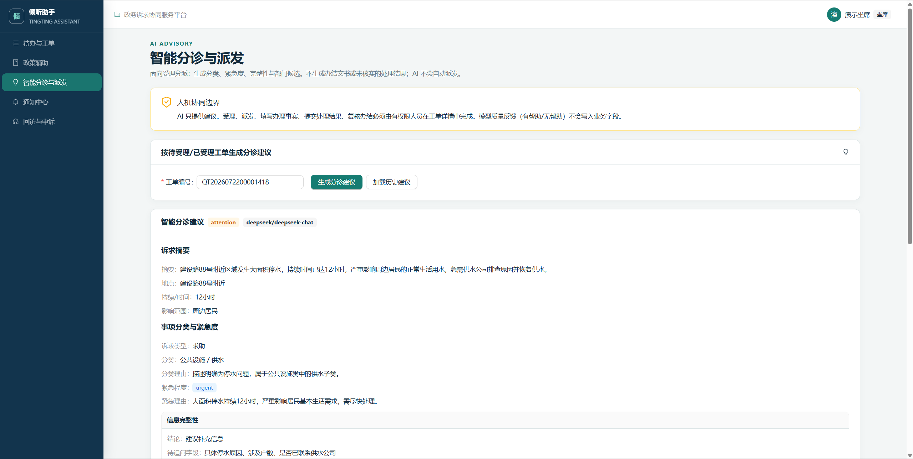
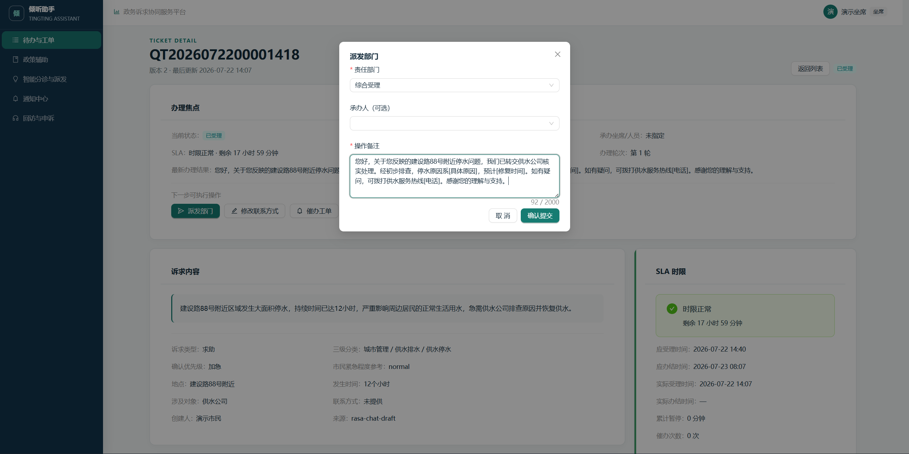
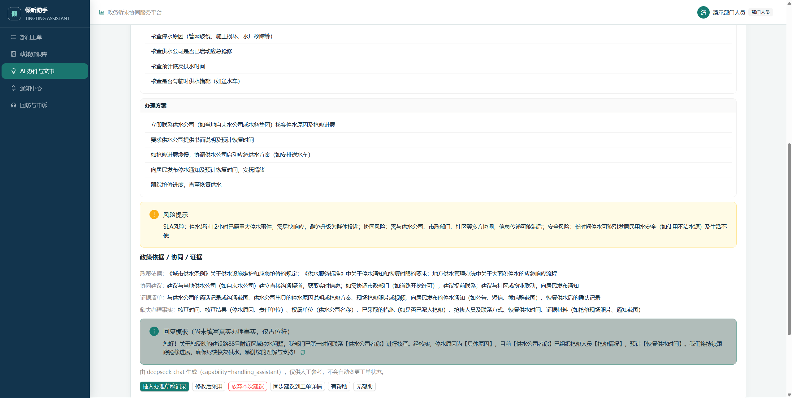
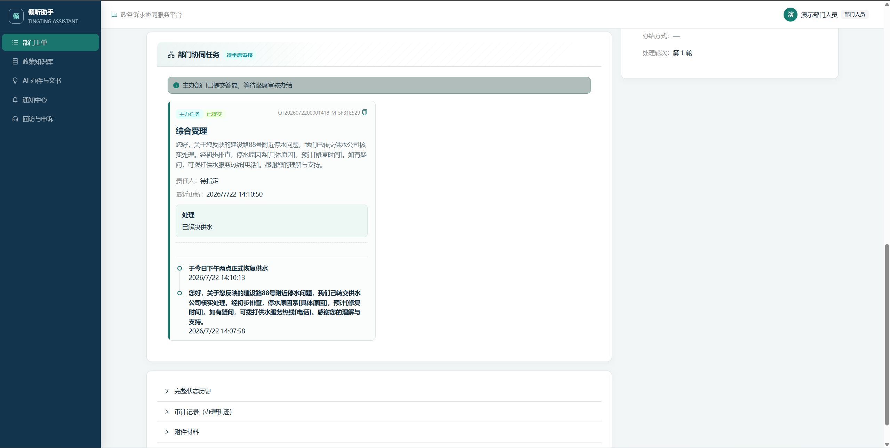
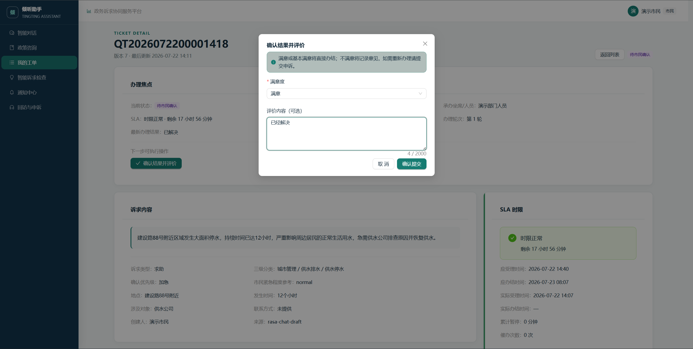
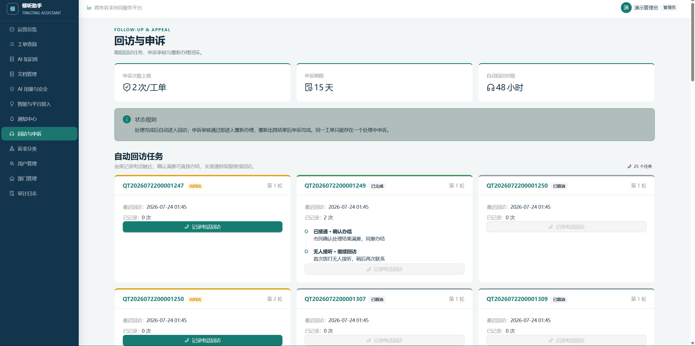

# 倾听助手 Tingting Assistant

倾听助手是一个面向市民诉求受理与跨部门协同办理的政务服务**演示平台**。系统把「市民政策咨询（RAG）→ 工单全生命周期 → AI 办件辅助建议 → 知识库治理 → 审计追踪」做成一条可运行、可测试、可复现的闭环，由 FastAPI + PostgreSQL+pgvector + React+TypeScript+antd + Rasa + Docker Compose 构成。

项目重点是可信业务状态机、四角色权限、AI advisory-only 与降级审计，而不是页面堆叠。所有数据均为演示种子数据；外部短信/OIDC/地图/政务平台均为可配置适配器，默认 disabled。**不宣称**微服务拆分、真实政府生产上线、等保测评或高并发压测达标。

**文档核对点**：Commit `438047c776787da6c5b412c403c7799ba52364c8` · Alembic head **`0025`**。

## 界面预览

按演示主闭环选取关键界面（市民建单 → 坐席分诊派发 → 部门办件 → 市民确认 → 运营总览）。

### 市民建单

智能对话识别诉求，右侧自动填充工单草稿，市民核对后提交。



### 坐席分诊派发

AI 给出分类 / 紧急度 / 归口建议（advisory only），坐席确认后派发责任部门。





### 部门办件

部门人员使用 AI 办件助手生成办理方案与回复模板，提交办理结果并回传坐席复核。





### 市民确认与运营总览

市民确认结果并评价；管理员在运营总览查看工单状态与诉求分布。





## 核心功能

| 模块 | 已实现能力 |
|---|---|
| 市民政策咨询 | RAG（pgvector + 关键词回退）；引用含 `title/doc_number/issuing_authority/excerpt`；无证据 `no_evidence` |
| 工单生命周期 | `pending → accepted → assigned → processing → resolved → closed`；部门提交后待坐席 `review-resolve`；含 `rejected`、乐观锁、幂等创建 |
| 多部门协同 | `work_orders` 主办/协办/复核；退回/转派/提交；`awaiting_review` 后由坐席复核办结 |
| AI 角色辅助 | 坐席 `triage_assistant` vs 部门 `handling_assistant`；采纳只记决策，**不**自动改状态/写业务字段 |
| 知识库 | 上传 → 解析 → 审核 → 发布 → 版本 → 可见性 → 过期下架 |
| Rasa + Orchestrator | 规则→OOD→LLM 分层路由；session 隔离 |
| AI 审计 | `ai_usage_logs`（含 capability / tokens / **估算** cost / degrade_reason） |
| 通知 / 回访 / 申诉 | 通知 outbox；回访任务；申诉**批准后**才重办 |
| 4 角色 | citizen、agent、department_staff、admin；`AuthorizationPolicy` |
| 可复现交付 | 开发 Compose **8** 服务；生产 override 追加 Caddy + ClamAV；Alembic；演示 reset |

## 技术栈

**Frontend**：React 19、TypeScript、Vite、Ant Design、TanStack Query、Vitest、Playwright

**Backend**：FastAPI、SQLAlchemy、Alembic、PostgreSQL 16 + pgvector、JWT、Argon2

**Conversation**：Rasa 3.6.20、Action Server、Duckling、PostgreSQL Tracker

**AI**：DeepSeek（OpenAI 兼容）+ SiliconFlow Embedding（默认 1024 维）；无密钥降级规则引擎

**Infra**：Docker Compose、MinIO、worker（SLA + outbox + 登录限流清理）

## 快速开始

```powershell
Copy-Item .env.example .env
# 至少填写：POSTGRES_PASSWORD / JWT_SECRET / SERVICE_API_TOKEN / SEED_PASSWORD
# 可选：AI_PROVIDER=deepseek、AI_API_KEY、EMBEDDING_API_KEY

docker compose pull --ignore-buildable
docker compose build
docker compose up -d --wait --remove-orphans
```

| 入口 | URL |
|---|---|
| Web | `http://localhost:8080` |
| OpenAPI | `http://127.0.0.1:8001/docs` |
| Ready | `http://127.0.0.1:8001/health/ready` |
| Rasa | `http://localhost:5005/status` |
| MinIO Console | `http://localhost:9001` |

Backend 默认绑 `127.0.0.1:8001`。

## 演示账号

密码来自 `SEED_PASSWORD`。仓库演示常用值：`tingting-seed-demo-2026`（仅本地演示，禁止生产）。

| 角色 | 用户名 | 部门 |
|---|---|---|
| 市民 | `citizen_local` | — |
| 坐席 | `agent_local` | — |
| 部门人员 | `department_local` | **综合受理** |
| 管理员 | `admin_local` | — |

主闭环：坐席派发选「综合受理」，用 `department_local` 办理。详见 [docs/DEMO.md](docs/DEMO.md)。

## 一键 Reset

```powershell
docker exec -w /app `
  -e SEED_PASSWORD=tingting-seed-demo-2026 `
  -e CONFIRM_DEMO_RESET=YES `
  tingting-assistant-backend-1 `
  python -m scripts.demo_reset --confirm-reset
```

`APP_ENV=production` 会拒绝执行。

## 测试（摘要）

默认门禁 = 单元/集成/构建 + Playwright **Smoke**（6 条 Chromium），**不是**全量 E2E。完整命令与「未验证」说明见 [docs/TESTING.md](docs/TESTING.md)。

```powershell
docker compose exec -T backend pytest -q
cd frontend; npm test; npm run lint:types; npm run build
# Smoke（隔离环境推荐）
# $env:E2E_PASSWORD="..."; sh scripts/run-e2e.sh smoke
```

本轮文档整理**未重跑**上述命令。

## 文档索引

| 文档 | 内容 |
|---|---|
| [PRODUCT.md](PRODUCT.md) | 角色、闭环、状态机、产品边界 |
| [ENGINEERING.md](ENGINEERING.md) | 架构、数据、AI/RAG、安全、取舍 |
| [docs/DEMO.md](docs/DEMO.md) | 五分钟可执行演示 |
| [docs/TESTING.md](docs/TESTING.md) | 测试命令与门禁 |
| [docs/DEPLOYMENT.md](docs/DEPLOYMENT.md) | Compose / 环境变量 / MinIO / ClamAV / Caddy / 备份 / 可观测性 |
| [docs/database-design.md](docs/database-design.md) | 核心表与 Ticket/WorkOrder |
| [docs/RELEASE_NOTES_v1.0.0.md](docs/RELEASE_NOTES_v1.0.0.md) | v1.0.0 基线说明 |
| [docs/security-exceptions.md](docs/security-exceptions.md) | 已知安全例外 |
| [docs/archive/README.md](docs/archive/README.md) | 过程稿 / 过期报告归档索引 |
| [NOTICE.md](NOTICE.md) | 第三方声明 |

过程稿与过期报告已移入 [docs/archive/](docs/archive/)（含旧 CI 摘要、演示脚本、部署/安全旧稿、面试材料等）。

## 项目结构概览

```
helpdesk-assistant-main/
├── backend/app/          # FastAPI、services、AuthorizationPolicy、seed
├── backend/migrations/   # Alembic 0001–0025（head=0025）
├── frontend/             # React + e2e（smoke + 全量可选）
├── actions/              # Rasa Action Server
├── data/                 # Rasa NLU / stories
├── docs/                 # DEMO / TESTING / DEPLOYMENT 等
├── docker-compose.yml    # 开发 8 服务
├── docker-compose.prod.yml
├── PRODUCT.md / ENGINEERING.md / README.md
└── .github/workflows/ci.yml
```

## 能力边界

- 单机 Compose 演示级部署；不做 K8s / 多机 HA / 零停机发布宣称。
- AI 不自动受理、派发、办结；成本为估算。
- 无业务 SSE 流式接口（文件下载除外）。
- 数据均为演示种子，非真实政务数据。
