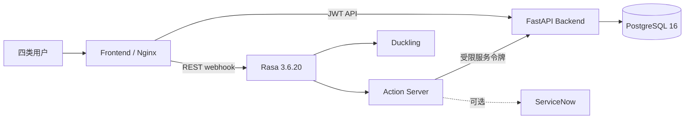

# 当前架构与调用链路

V1.0 是 React/Nginx、FastAPI、PostgreSQL、MinIO、Rasa、Action Server、Duckling 七服务架构。中文政务闭环与原英文 Helpdesk、ServiceNow、handoff 兼容资产并存；完整图示、职责、状态机和权限矩阵见 [项目总览](project-overview.md)。

## 可信边界

- Rasa 负责 NLU、tracker、策略和表单，不作为工单真相源。
- Action Server 负责对话适配；中文创建/查询通过 HTTP gateway 调用 Backend。
- Backend 集中处理身份、四角色授权、状态机、幂等、乐观锁、时间标准化和审计。
- PostgreSQL 保存用户、部门、工单、状态历史、市民评价、AI 建议、集成事件和审计；Alembic 当前为 `0009 (head)`。
- Nginx 是浏览器唯一入口，代理 `/api/` 与 `/rasa/`，并设置请求体、超时和安全响应头。

## 配置边界

- `.env` 不提交；生产秘密由部署平台注入。
- Rasa 固定加载 `models/tingting-v1.1.0-rasa3.6.20.tar.gz`，避免目录最新文件选择漂移。
- `ACTION_SERVER_URL`、`DUCKLING_URL`、`TICKET_SERVICE_URL` 只使用 Compose 内部 DNS。
- Action Server 只绑定本机回环地址；浏览器和外网入口必须通过 Nginx/Rasa，而非直接访问其 webhook。
- ServiceNow 默认为本地模式；`HANDOFF_*` 未配置时安全降级，不使用历史外部演示地址。
