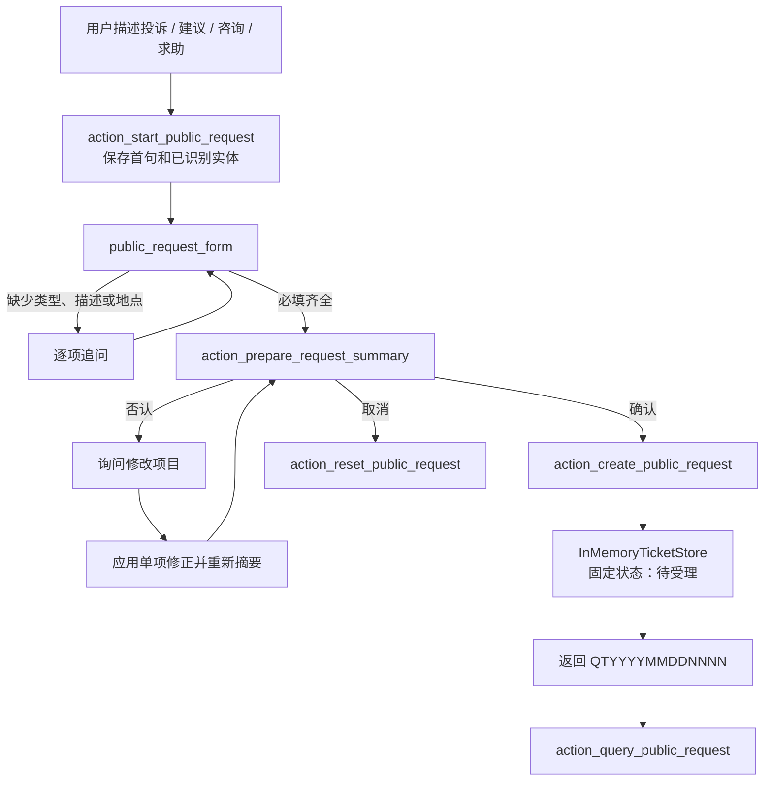

# 中文诉求登记流程

## 主流程

首句完整文本由 `action_start_public_request` 保存为 `description`。NLU 已识别的地点、时间和对象同时写入槽位，表单不会重复询问。咨询没有具体地点时可回复“不适用”，时间始终为可选项。

摘要展示类型、描述、地点、时间、对象和联系方式；可选空值统一显示“未提供”。否认摘要只进入单项修正，不清空已有数据。`cancel_request` 可在表单、确认或修正阶段取消当前登记。

## 工单与查询

`actions/ticket_store.py` 提供：

- `create_ticket(...)`
- `get_ticket(ticket_id)`
- `query_tickets(**criteria)`
- `update_ticket_status(ticket_id, status)`

编号按北京时间日期和进程内日序号生成，例如 `QT202607130001`；默认状态固定为“待受理”。同一 Action Server 进程内可立即查询。无编号且无最近工单时会先询问编号；不存在的编号明确返回“未找到”；仓储异常返回可理解的降级提示。

这是线程安全的进程内 Mock，不是数据库：Action Server/容器重启后工单和序号都会丢失，多副本之间也不共享。Repository 与 Rasa Action 分离，后续可替换为正式接口，但本轮未接 FastAPI、PostgreSQL 或 Redis。

## Rasa 3.x 兼容处理

条件规则结束时，终止型 Action 显式调度 `action_listen`，避免 Rasa Core fallback 的 `UserUtteranceReverted` 回滚刚写入的工单号或修正槽位。这个行为已用真实 REST tracker 和闭环烟测验证。
