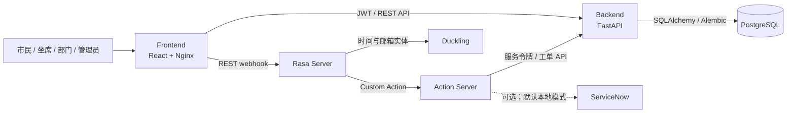
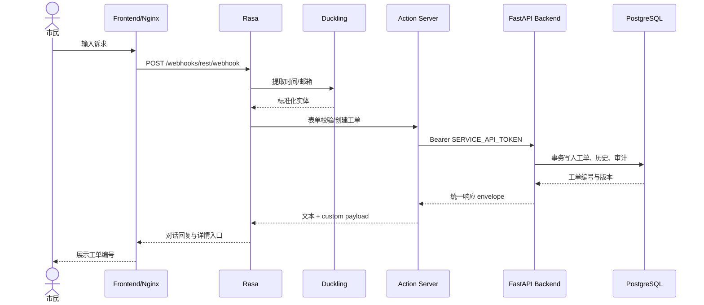
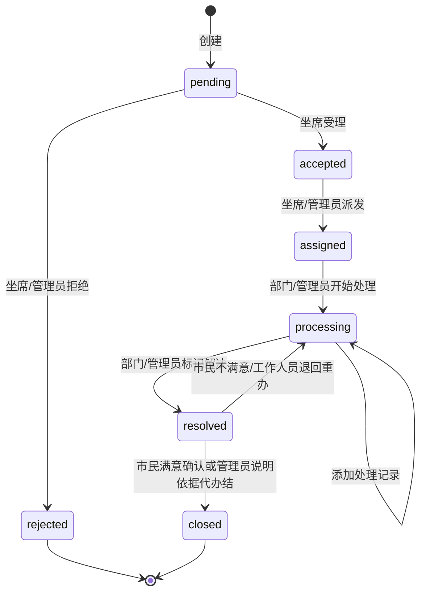

# 倾听助手 V1.0 项目总览

## 项目背景与业务价值

倾听助手（Tingting Assistant）面向市民诉求受理场景，把“自然语言登记—人工受理—部门办理—结果确认—审计追踪”放进一条可演示、可测试的业务链路。它解决三个典型问题：市民不知道该找哪个部门，坐席与部门之间缺少统一工单状态，管理人员缺少可追责的数据视图。

V1.0 的重点不是堆叠页面，而是证明一个小型业务系统可以同时具备对话入口、严格状态机、四角色权限、持久化、可观测性、备份恢复和自动化质量门禁。原英文 Helpdesk、ServiceNow 适配和人工 handoff 资产继续保留，与中文政务诉求链路并存。

## 系统架构

六个 Docker 服务的职责如下：

| 服务 | 责任 | 健康检查 |
|---|---|---|
| frontend | 静态页面、SPA 路由、Backend/Rasa 反向代理、安全响应头 | `/healthz` |
| backend | 登录、权限、工单状态机、管理、统计、审计 | `/health/live`、`/health/ready` |
| postgres | 用户、部门、工单、处理记录与审计持久化 | `pg_isready` |
| rasa | NLU、对话策略、表单和 tracker | `/status` |
| action_server | 中文诉求、旧 Helpdesk、ServiceNow、handoff 自定义 Action | `/health` |
| duckling | 中文时间与邮箱等结构化实体提取 | TCP 8000 |

## 六服务调用链路

## 工单状态机

每次写操作都携带当前 `version` 和非空备注。Backend 在同一事务内校验角色、数据范围、合法状态边并执行 `version + 1`；旧版本返回 409，避免并发覆盖。

## 四角色权限

| 能力 | 市民 citizen | 坐席 agent | 部门 department_staff | 管理员 admin |
|---|---|---|---|---|
| 数据范围 | 本人创建 | 待受理、未派发 | 本部门 | 全部 |
| 创建诉求 | 是 | 是 | 否 | 是 |
| 受理、拒绝、派发 | 否 | 是 | 否 | 是 |
| 处理、记录、解决 | 否 | 否 | 本部门 | 是 |
| 最终办结 | 否 | 否 | 否 | 是 |
| 用户、部门、审计、看板 | 否 | 否 | 否 | 是 |

后端 `AuthorizationPolicy` 是权限规则唯一入口；前端路由守卫负责体验，不能替代后端授权。

## 核心技术难点与解决方案

1. 对话与事务系统的一致性：Action Server 不再保存进程内主数据，而是用独立服务令牌调用 Backend；创建使用幂等键，Backend 统一写工单、历史和审计。
2. 多角色数据隔离：把角色、数据范围和动作权限集中到策略层，API、测试和 UI 共用相同业务语义，并覆盖越权失败用例。
3. 并发办理：工单版本号实现乐观锁；UI 收到 409 后提示并刷新，不静默覆盖他人操作。
4. Rasa 旧资产兼容：Rasa Core 3.6.20、SDK 3.6.2 与重新训练的 v1.1.0 模型固定部署；英文 Helpdesk、ServiceNow 和 handoff 由独立对话回归保护。
5. 可复现交付：六服务 Compose、Alembic 自动迁移、幂等 Seed、镜像 digest、Python/Node 锁文件和三浏览器独立 E2E 共同保证复现。
6. 安全与排障：短期 JWT、Argon2、服务身份、限流、请求体/超时、安全头、结构化日志、`request_id`、审计和 live/ready 分离。

## 测试与质量数据

当前门禁包含 Python 编译与 Ruff、Backend 18 条测试、Action 21 条测试、Rasa 数据校验、Core 24 条故事、NLU 测试、TypeScript、Vitest 12 条、生产构建、Docker 集成和 Playwright 三浏览器各 21 条，共 63 条 E2E。V1.0 基线结果见 [第七轮发布报告](round-7-release-report.md)。

## 项目边界

V1.0 是可展示的工程化单体系统：不接真实政务平台，不引入大模型/RAG，不包含 Kubernetes、ELK、Prometheus，也不以当前单机 Compose 形态宣称生产高可用。演进建议见 [生产化路线图](production-roadmap.md)。
